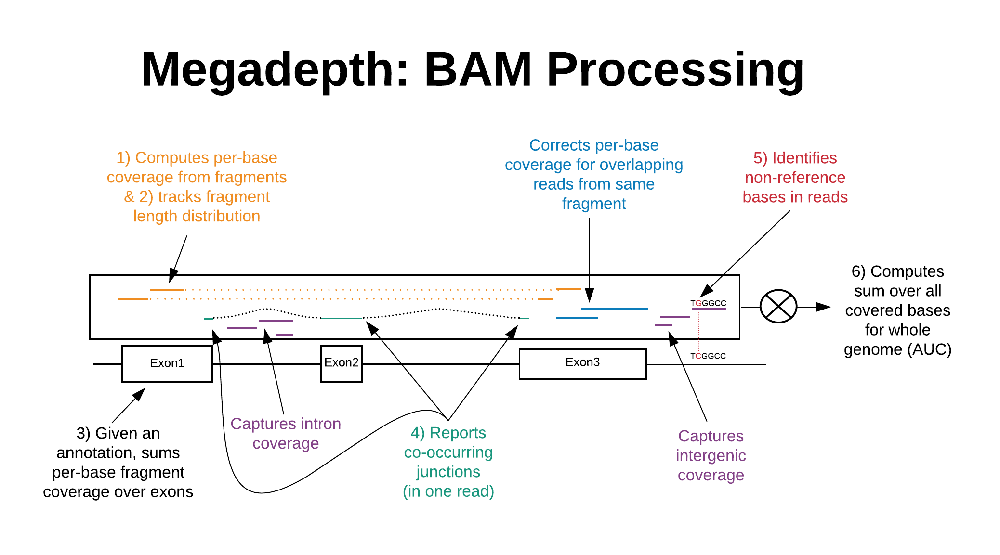

[](https://gitter.im/megadepth/community?utm_source=badge&utm_medium=badge&utm_campaign=pr-badge&utm_content=badge)


BigWig and BAM/CRAM related utilities [](http://bioconda.github.io/recipes/megadepth/README.html)

We recommend use of one of the pre-compiled binaries (only x86_64):

* [Linux](https://github.com/ChristopherWilks/megadepth/releases/download/1.1.0/megadepth)*
* [MacOS](https://github.com/ChristopherWilks/megadepth/releases/download/1.1.0/megadepth_macos)
* [Windows Native](https://github.com/ChristopherWilks/megadepth/releases/download/1.1.0/megadepth.exe)

*this binary has the HTSlib, libBigWig, libcurl, libdeflate, & zlib libraries statically linked.

Megadepth is also available under [R/Bioconductor](http://www.bioconductor.org/packages/release/bioc/html/megadepth.html)

If none of those options work, the a Docker image and build instructions are described at the end of this README.

If you find Megadepth useful, please cite the publication:

`Wilks, C, Ahmed, O, Baker, DN, Zhang, D, Collado-Torres, L, Langmead, B (2021). Megadepth: efficient coverage quantification for BigWigs and BAMs. Bioinformatics`

[Releases prior to 1.0.2 used the previous name "bamcount"]

# Usage

For any remote file processing, either BAM or BigWigs, you *must* use the `--prefix <output_file_prefix>` option.

Additionally, when using `--annotation`, `--op <op>` can be used to change the mode of summary:

* BAMs, `<op>` can be `sum` (default) or `mean`
* BigWigs, `<op>` can be `sum` (default), `mean`, `min`, or `max`

Default output of `--coverage` and `--auc` is to standard out (console/terminal).

To change that, you can either add `--gzip` which fill force the output of `--coverage` into a gzipped file* (takes a little longer) in addition to a BigWig file.

You can also individually specify via `--no-auc-stdout`, `--no-annotation-stdout`, and/or `--no-coverage-stdout` that the output of  `--auc`, `--annotation` and/or `--coverage` should *not* be written to standard out but to a file with the same prefix as the other options (i.e. using `--prefix`'s argument).  In any case, if `--coverage` is specified, BigWig files will be output no matter the other options.

*known bug, this doesn't apply to the `all` base-level coverage case, only to the unique (`--min-unique-qual 10`) case, all base-level coverage will either be output to standard out and/or to a BigWig file, but never to a gzipped file at this point.

When running on certain BAMs/annotation BED files, you may see a warning (one or more of them) like this:
```[W::hts_reglist_create] Region 'SIRV7:4095-4179' specifies an unknown reference name. Continue anyway```
where `'SIRV7:4095-4179'` could be any region that's not present in the BAM but is present in the annotation BED file.

This can be ignored if you know that the BAM file doesn't contain those contigs/chromosomes (in this case the SIRV7 contig is not present in the BAM file being run).

## BigWig Processing
```
megadepth /path/to/bigwigfile --annotation <annotated_intervals.bed> --op <operation_over_annotated_intervals>
```

Concrete example command for sample `SRR1258218` (NA12878 Illumina RNA-seq), this will produce 1) means for the intervals listed in `exons.bed` and 2) the total annotated AUC (output `STDOUT`):
```
megadepth SRR1258218.bw --annotation exons.bed --op mean --auc
```

Or if you only want the AUC for the whole BigWig:
```
megadepth SRR1258218.bw
```

## BAM/CRAM processing
While megadepth doesn't require a BAM/CRAM index file (typically `<prefix>.bam.bai` or `<prefix>.bam.crai`) to run, it *does* require that the input BAM be sorted by chromosome at least.  This is because megadepth allocates a per-base counts array across the entirety of the current chromosome before processing the alignments from that chromosome.  If reads alignments are not grouped by chromosome in the BAM, undefined behavior will occur including massive slow downs and/or memory allocations.

A BAM/CRAM index file is recommended for best performance on sparse regions when `--annotation <regions.bed>` is used.

If a CRAM file is being processed, the reference FASTA may be retrieved from an external webserver (default) or specified with `--fasta /path/to/reference.fa`.

Read alignments can be filtered in (inclusion) via `--filter-in <integer>` or filtered out (exclusion) via `--filter-out <integer>`, where `<integer>` is as bitmask according to the SAM specification in decimal. The defaults are `--filter-in 65535` and `--filter-out 260` to skip only unmapped and secondary alignments, processing everything else.

Concrete example command for sample `SRR1258218` (NA12878 Illumina RNA-seq):

```
megadepth SRR1258218.sorted.bam --threads 4 --bigwig --auc --annotation exons.bed --prefix SRR1258218
```

If you only want to get a coverage summary (either sum or mean) over a set of intervals, you may see a performance boost if you have a BAM index at the same path as the BAM file:
```
megadepth SRR1258218.sorted.bam --annotation exons.bed --prefix SRR1258218 --gzip
```

Also, the optional `--gzip` flag in the above example will automatically turn off writing to `STDOUT` any coverage (either base or annotation),
and will instead write coverage to block gzipped files using the `--prefix` or input filename as the base filename.
These block gzipped files will also have a Tabix-like index `.csi` built for them as well.  There's a known bug where chromosomes with 0 coverage are still reported in the block-gzipped files but are not indexed.

# BAM/CRAM Processing Subcommands



For any and all subcommands below, if run together, `megadepth` will do only one pass through the BAM file.
While any given subcommand may not be particularly fast on its own, doing them all together can save time.

Subcommand `--bigwig` is the only subcommand that will output a BigWig file with the suffix `.coverage.bw`.
If `--min-unique-qual` and `--bigwig` are specified the "unique" coverage will also be written to a separate BigWig file with the suffix `.unique.bw`.

Also, `--bigwig` will not work on Windows, megadepth as of release 1.0.5 will simply skip writing a BigWig if this option is passed in with the Windows build, but will process other options which still make sense (e.g. `--auc`).

## Coverage over regions

### `megadepth /path/to/bamfile --annotation <annotated_file.bed>`

generates per-base counts across all regions in `<annotated_file.bed>` file.

This will use the BAM index file (.bai) if it exists, otherwise it will do a linear walkthrough the BAM, but only reporting the coverage for the regions specified (typically much slower w/o an index).

The annotation BED file does not need to be sorted in any particular way.

megadepth will output the summed coverages for the annotation in contiguous blocks per chromosome.

This will be the same order as the BED file *if* coordinates from the same chromosome are contiguous in the BED file (typically they are).

You can skip the index with `--no-index` in cases where the regions cover nearly the whole genome (can be faster than jumping around the index).

### `megadepth /path/to/bamfile --annotation <bp>`

generates coverage sums over a specified number of base pair length contiguous windows of the genome (e.g. 400 bp).

All subcommands here will default to reporting to `STDOUT` unless `--no-annotation-stdout` or `--gzip` is passed in.

## Coverage over the whole genome

There's multiple ways to get whole genome, per-base coverage:

### `megadepth /path/to/bamfile --coverage`

Generates per-base counts of overlapping reads across all bases of the genome.
All coverage is included, even mismatching bases.  So this output should be thought of as ref base + alternate base sums (if using `--alts` in addition, see below).

Typically this is used to produce a BigWig, but can be used w/o the `--bigwig` option to just output TSVs

Will default to reporting to `STDOUT` unless `--no-coverage-stdout` or `--gzip` is passed in.

By default, `--coverage` and `--bigwig` (below) will not double count coverage where paired-end reads overlap (same as `Mosdepth`'s default).
However, double counting can be allowed with the `--double-count` option, which may result in faster running times if precise counting is not needed.

### `megadepth /path/to/bamfile --bigwig`

Outputs coverage (same as `--coverage) except as BigWig file(s) instead of TSVs (including for `--min-unique-qual` option), this is an alterate subcommand to `--coverage`.

### `megadepth /path/to/bamfile --auc`

Reports area-under-coverage across all bases (one large sum of overlapping reads, per-base).
This will also report additional counts for:
 * `min-unique-qual` only for reads with MAPQ >= to this setting
 * `--annotation`: only for bases in the annotated regions
 
This computes the coverage (same as `--coverage` and `--bigwig`) under the hood, but won't output it unless `--coverage` or `--bigwig` is also passed in.

Will default to reporting to `STDOUT` unless `--no-auc-stdout` is passed in.

## Fragment Length Distribution

### `megadepth /path/to/bamfile --frag-dist`

Outputs fragment length distribution adjusting for intron lengths.

Mean, mode statistics are reported at the end of the output with string tag `STATS`.

This uses the absolute value of the `TLEN` field but uses additional filters similar to [csaw](https://github.com/LTLA/csaw)'s fragment length calculation.

The following alignments are filtered out:

 * secondary
 * supplementary
 * not paired
 * unmapped
 * mate unmapped
 * discordant (mates not on same chromosome/reference)

Further, read mates must be on forward/reverse strands and the forward mate must not be downstream of the reverse mate.

Intron length(s) in the paired alignments are also subtracted from the `TLEN` field except where the `TLEN` field is smaller than the combined length of the introns, in which case the `TLEN` is reported as is.

These numbers should be taken as an estimation of the fragment length distribtion.

Reports to a file with suffix `.frags.tsv`.

## Alternate Base Coverage

### `megadepth /path/to/bamfile --alts`

Outputs information about non-reference-matching portions of reads.
Output is comma separated with 4 fields:

| Pos   |                                            Descrtiption |
|-------|------------------------------------------------------------------------|
| 1     | Reference/chromosome ID in the BAM file (integer)                      |
| 2     | POS field (0-based offset of leftmost aligned ref base)                |
| 3     | Operation label (see table below)                                      |
| 4     | Extra info (see table below)                                           |
| 5     | Read ID/name if paired alignment overlaps between mates (blank if not) |
| 6     | Intentionally left blank                                               |

As field 6 is always blank, there will always be a trailing ',' for X, I, and D records.

These could be of a few types, summarized in this table.  All of
these are available when the `MD:Z` extra flag is present.  If not
present, only the ones with "Yes" in the "No `MD:Z`" column are
reported.

| Label | Type       |          Extra info  | No `MD:Z`  |
|-------|------------|----------------------|------------|
| `X`   | Mismatch   |            Read base |         No |
| `D`   | Deletion   |      # deleted bases |        Yes |
| `I`   | Insertion  |  Inserted read bases |        Yes |
| `S`   | Soft clip  |   Soft clipped bases |        Yes |
| `H`   | Hard clip  |            (nothing) |        Yes |
| `P`   | Padding    |            (nothing) |        Yes |

For example, assuming a BAM file produced by the STAR v2.7.3a aligner which has 
an alignment record at chromosome 11, starting as position 100 (1-base), with a mismatch of a `T` (alt) vs. a `G` (ref) 11 bases from the left starting position of the alignment (inclusive):

`... chr11 100 ... MD:Z:10G20`

there will be a corresponding line in the output of `--alts`

`10,109,X,T,,`

where `T` is the base in the read sequence aligned in that record (reference `G`), 
and 10 is the offset of the chromosome ID from the BAM header 
(this offset will vary with the reference used to align).

The empty field is reserved for the case where the two mates in a read pair
have an overlapping alignment.  In that case the read ID/name is printed in the
5th field to indicate overlap.  Typically this will allow for the removal of
duplicate alternative base calls and help to inform deciding between conflicting
calls where the overlapping mates may not have the same call.  This only applies to 
mismatches ('X'), insertions ('I'), and deletions ('D'), not to soft-clipping (below).
If coverage is not being computed (`--bigwig` or `--coverage`) as well, overlapping pairs
will *not* be flagged when `--alts` is used.

See the usage message for options, which can selectively disable some
of the outputs listed above.  E.g. the soft-clipping outputs can be
very large, so they're not printed unless `--include-softclip` is
specified.

Reports to a file with suffix `.alts.tsv`.

### `megadepth /path/to/bamfile --alts --include-softclip`

In addition to the alternate base output, this reports the bases
that were softclipped at the ends (start/end) of the read.
These are bases which are left in the sequence but don't align.

The softclipped bases themselves are printed to the file named with the
prefix passed into the `--alts` option.  The total number of sofclipped
bases and the total number of bases from the query sequences of alignments
that that aren't unmapped or secondary are reported to the file named
with the prefix passed to `--include-softclip`.

Warning: using this option w/o modifiers (e.g. `--only-polya`) 
could blow up the `--alts` output size as the full softclipped
sequence is printed in the 4th column in the table above ("Extra info").

Reports to a file with suffix `.softclip.tsv` in addition to the `--alts` file.

### `megadepth /path/to/bamfile --alts --include-softclip --only-polya`

If reporting softclipped bases, this option will limit the report to only
those bases that have the following:

* Count of bases in the sofclip (column 4 below) has to be >= 3
* % of base (A/T) of softclipped bases for an alignment >= 80%

No other sofclipped bases are reported.

Output is comma separated with 7 fields:

| Pos   |                                                                      Description|
|-------|----------------------------------------------------------------------------------|
| 1     | Reference/chromosome ID in the BAM file (integer)                                |
| 2     | POS field (0-based ref offset of either leftmost or rightmost aligned base)      |
| 3     | Operation label (always "S")                                                     |
| 4     | Number of bases in the softclip (run length)                                     |
| 5     | Intentionally left blank to be compatible with previous alt. format              |
| 6     | Direction to move from POS ('+' for end of alignment, '-' for start of alignment)|
| 7     | Base (A/T)                                                                       |
| 8     | Count of the base in column 6                                                    |

## Junctions

### Reporting All Junctions

#### `megadepth /path/to/bamfile --all-junctions`

Extracts all intron spanning alignments from the BAM and reports them, one per line.

Output format:

| Pos    |                                                                            Description|
|--------|---------------------------------------------------------------------------------------|
| 1      | Read name (for removing duplicate junction reports for overlapping read mates)        |
| 2      | Reference/chromosome ID in the BAM file (integer)                                     |
| 3      | Start coordinate of intron (1-based ref offset of leftmost base of intron)            |
| 4      | End coordinate of intron (1-based ref offset of rightmost base of intron)             |
| 5*     | Mapping strand of alignment (0 forward, 1 reverse)                                    |
| 6      | Cigar string (useful for determining anchor lengths)                                  |
| 7      | Is unique alignment? (0:no, 1:yes; needed for counting unique split read support)     |

\*This is the strand of the alignment, not necessarily the strand of the junction, that has to be determined by the dinucleotide motifs at the coordinates given.
However, if the BAM includes the `XS:A` tag for certain alignment records the strand here will be `+` or `-` taken from that tag and then indicates the true strand of source transcript based on if canonical splicing info is available.

This output can be further processed by the script, `junctions/process_jx_output.sh` to get a merged set of junctions with unique and multi-mapping counts, compatible with STAR's `SJ.out` junction file (sans the last column which is left blank, but would be maximum anchor length per junction if coming from STAR).

NOTE: No junction filtering is done by Megadepth here, it will simply report every potential junction it finds in the BAM file, subject to the general alignment filters already in place (e.g. using the SAM flags to filter out umapped reads, secondary alignments, etc...). 

If comparing with STAR's SJ.out file for the same BAM, be aware that STAR will likely not do the same alignment level filtering, so the results will be different in terms of 1) number of junctions found and 2) split-read counts for a junction found in both approaches.

Reports to a file with suffix `.all_jxs.tsv`.

### Co-occurring Junctions

#### `megadepth /path/to/bamfile --junctions`

Extract locally co-occurring junctions from BAM.

This does not extract all potential junctions (use `--all-junctions` for that), only those for which a read (or read pair) had >= 2 junctions. This can be run instead of OR in addition to `--all-junctions`, to specifically report co-occurring junctions.  Since the output format below includes co-occurring jx's on the same line, it's potentially useful to run both.

In a paired context, there must be at least 2 junctions across the 2 read mates to be output.

Output is tab separated with 6-12 fields (the last 6 fields are for a 2nd mate if applicable):

| Pos    |                                                                            Description|
|--------|---------------------------------------------------------------------------------------|
| 1      | Reference/chromosome ID in the BAM file (integer)                                     |
| 2      | POS field (1-based ref offset of either leftmost base)                                |
| 3      | Mapping strand (0 forward, 1 reverse)**                                               |
| 4      | Insert length (0 if not paired)                                                       |
| 5      | Cigar string (useful for determining anchor lengths)                                  |
| 6      | List of junction coordinates (comma-delimited)                                        |
| 7      | Is unique alignment? (0:no, 1:yes; needed for counting unique split read support)     |
| 8*     | Mate reference record ID                                                              |
| 9*     | Mate POS field (1-based ref offset of either leftmost base)                           |
| 10*    | Mate mapping strand (0 forward, 1 reverse)**                                          |
| 11*    | Mate insert length (0 if not paired)                                                  |
| 12*    | Mate cigar string (useful for determining anchor lengths)                             |
| 13*    | Mate list of junction coordinates (comma-delimited)                                   |
| 14*    | Mate is unique alignment? (0:no, 1:yes; needed for counting unique split read support)|

\*optional, output if a 2nd mate is present and has the required number of junctions.

\*\*This is the strand of the alignment, not necessarily the strand of the junction, that has to be determined by the dinucleotide motifs at the coordinates given.
However, if the BAM includes the `XS:A` tag for certain alignment records the strand here will be `+` or `-` taken from that tag and then indicates the true strand of source transcript based on if canonical splicing info is available.

If you get a core dump when running on longer reads (e.g. BAM's produced by PacBio/Oxford Nanopore sequencing), or something like this abort message:
```*** Error in `megadepth': free(): invalid next size (normal): 0x0000000001d30780 ***```

then try adding the argument `--long-reads` as it will enlarge the buffer used to store the output junction string.

This enables megadepth to have a better chance of handling really long CIGAR strings.

Reports to a file with suffix `.jxs.tsv`.

Similar to `--all-junctions`, no junction filtering is done by Megadepth for this option, it will simply report all co-occurring, potential junctions it finds in the BAM file.

# Docker 
Additionally, there is a Docker image that can be used to run `megadepth`:

https://quay.io/repository/broadsword/megadepth?tab=tags

For running under Docker, you'll probably want to map in a directory on the host system into the container via the `-v` option so you can pass an annotation file in and get output back:

```
docker run -v `pwd`:/data <image_id> </data/path_or_URL/to/input/BAM_or_BigWig> --annotation /data/<annotation>.bed --prefix /data/output_file_prefix
```

Currently, `libcurl` throws a warning about version information, this can be ignored.

# Building

## Build dependencies

* [htslib](http://www.htslib.org)
    * See `get_htslib.sh` for a script that gets a recent version and compiles it with minimal dependencies
* [libBigWig](https://github.com/dpryan79/libBigWig)
    * See `get_libBigWig.sh` for a script that gets a recent version and compiles it
* [libdeflate](https://github.com/ebiggers/libdeflate)
    * See `get_libdeflate.sh` for a script that gets a recent version and compiles it
* zlib static library [only if building a static binary]
    * See `get_zlib.sh` for a script that gets a recent version and compiles the static library

 
## Building

Before attempting to build Megadepth, we strongly suggest the user try to use one of the pre-built binaries or the Docker container provided at the top of this README.

The 3 primary dependencies for this build (htslib, libBigWig, libdeflate) are brought in via git's `submodule` system automatically.

To build Megadepth on a reasonably modern x86 Linux machine (with `libcurl` and `zlib`), run:

`build_megadepth.sh`

This builds a fully dynamic binary which requires that libraries for htslib and libBigWig be available in the environment where megadepth will be run.

We have provided a wrapper script, `megadepth`, which sets the environment to reference those two libraries where they were cloned, so megadepth can be run on the build machine.
